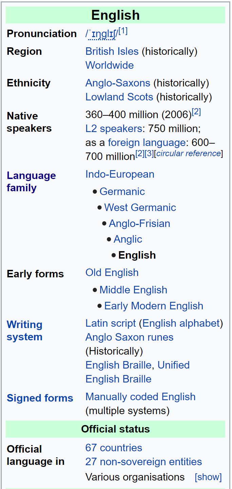

# Wikipedia Cheatsheet for Language Articles

## Intro
This guide is intended as a reference to the basics of Wikipedia editing. You may read it out of order or skip sections if you feel ready to move on.

***TODO:*** Note on wikipedia's CC0 attribution policy.

## Sandboxes
A ***sandbox*** is another name for a Wikipedia page that is hosted as part of your personal user page, instead of the main Wikipedia site. You can use your sandboxes for anything you'd like: drafting articles, adjusting to the editor, or practicing citations.

Keep in mind that even though your sandboxes aren't a part of the main Wikipedia site, they are still public, and anyone can view your edits there.

### Creating a new sandbox


## Using the Visual Editor
The Visual Editor is your standard text editor - It works very much the same as something like Google Docs or Microsoft Word, and has many of the same basic features.

In addition to the basics, the Visual editor also has a few useful tools for a variety of tasks, such as:
0. Citing sources
0. Formatting text and links
0. Inserting templates
0. Typing special characters

## Using the Source Editor
While the Visual Editor is user-friendly and lets you do most of the text-editing you'll need to write a standard Wikipedia article, there are some advanced features, like ***templates***, for which the Visual Editor isn't quite powerful enough.

## Section headings

## Links to other Wikipedia pages
On Wikipedia, the best practice is to link to other related pages whenever possible. This makes it easier for people to find your page (by linking to it), and makes it easier for people to find related topics while reading (by linking to those pages).

It's good to try to be comprehensive and link wherever possible, but you are not required to be completely exhaustive. There is such a thing as too many links. In general, try to add links to major topics the first time they are mentioned in an article. In longer articles, it may make sense to link to the same article several times (usually at the start of a new section or when the topic has been re-introduced), but use repeated links sparingly as they can make the page appear cluttered.

In Source Editing mode, you can add a link to an existing Wikipedia page by typing the name of the page enclosed in double square brackets, as below:
```
[[Linguistics]]
```

Optionally, you can change the text shown in the link by adding the desired link text after the page name, separated by a vertical bar: `|`.
```
[[Linguistics|the study of language]]
```

It's all but guaranteed that your page will discuss topics that already have existing Wikipedia pages, and you should make an effort to link to (at least some of) these pages. A non-exhaustive list follows:
* Linguistics
* Tone
* Vowel height, roundedness, etc.
* Consonants
* etc etc
* ***TODO: ADD PROPER LINKS***

## Infoboxes
If you've browsed Wikipedia before, you've likely noticed a small ***infobox*** like this one in the corner of a page, providing useful quick facts about a topic.


These infoboxes are easy to create on your own, using the `infobox language` template!

To use it, copy-paste the following template into the top of your page:
```
{{infobox Language
  |
  |
  |
}}
```

## Tables
Tables are unfortunately quite tedious to do correctly. Your best bet is probably to find an existing page that has a table in a similar format to the one you will need, and copy-paste it to your own page, modifying it as needed.

## Three-line glossing
It's very easy to include three-line glosses on your page using the `interlinear` template!

The basic usage is very straightforward, although there are also some more advanced features if desired.

Simply copy-paste the following template into your page where you would like the three-line gloss to appear:
```
{{interlinear | lang = XXX
  | words in the IPA
  | MEAN ING OF WORDS
  | "Loose translation of sentence, in quotes"
  }}
```

If desired, a reference can also be placed at the end of the

## References

### Citing a source for the first time
When you cite a source for the first time, you'll have to provide bibliographic information about that source, just as you would on a works cited page in other citation styles. There are several templates to make this easier, depending on whether you are trying to cite a book, website, or some other form of media.

The general format for defining a new citation is as follows:
```
<ref>Bibliographic info goes here... </ref>
```

When you define a reference like this, it's a good idea to give the reference a name so you don't have to keep re-typing all the same information. You can do this by providing a name for the citation, like this:
```
<ref name="UniqueAndMemorableName">Bibliographic info goes here... </ref>
```

The name can be any string of characters, but it's a good idea to make it something unique and specific to that source so it is clear to later editors which source is attached to which claim. A good idea is to make the reference name the surname of the primary author, followed by the year of publication, like this:
```
<ref name="Chomsky1986">Chomsky, Noam. "Article Name", 1968 </ref>
```


### Citing Ethnologue / Glottolog
Ethnologue and Glottolog are commonly cited enough that Wikipedia has special template and shortcuts defined specifically to cite them!

If you have

### Reusing citations
After you have cited a source once, and given it a name, you never have to enter in the bibliographic information for that source again! Instead, you can simply refer to the source by name, and the full citation will automatically be re-inserted.

```
This claim is attributed to Chomsky.<ref name="Chomsky1986" />
```

### Citing a specific page number
You can use the `rp` template to cite specific page numbers of a source.

To use it, simply copy-paste the following template into your article following the citation:

```
{{rp|360}}
```

For example, to cite a fact from page 35 of a 1986 paper by Chomsky

### Citation needed

### Ref

## Footnotes
